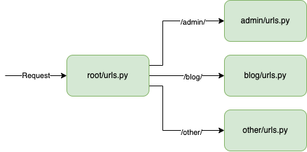

/ [Menu](/documentation/README.md) / [Urls](urls.md)

# Urls

Overview of how a request flows through a django project.

In this illustration, all requests that begin with `/admin/` is sent to the `admin`-application.



## Mapping

The general idea is to map a url to a handler. A handler (in Django called View) is simply a function that does "something", then finally returns a response.
It processes the request, maybe performs authentication, fetching data from the database etc.

Inside a `urls.py` file, Django will recognise the variable named `urlpatterns`.  
It's a list of `path(...)` entries.

A `path(...)` takes three arguments:

1. The url.
2. The view, or a nested `urls.py` file.
3. A name for the endpoint (optional).

Example:

```py
from django.urls import path, include

from something import views as something_views

urlpatterns = [
    path('something-cbw/', something_views.HelloView.as_view(), name='hello_cbw'), # Class based view.
    path('something-fbw/', something_views.hello, name='hello_fbw'), # Function based view.
    path('other/', include('other/urls.py')), # Delegate to another file.
]
```

<br>
<br>

👈 Back to [Menu](/documentation/README.md)
